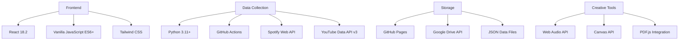

# 🎵 Casa 24 Records Dashboard

<div align="center">


**A comprehensive analytics and creative platform for Casa 24 Records collective**

[View Demo](https://casa24records.github.io) · [Report Bug](https://github.com/casa24records/dashboard/issues) · [Request Feature](https://github.com/casa24records/dashboard/issues)

</div>

---

## 📋 Table of Contents

- [Overview](#-overview)
- [Features](#-features)
- [Architecture](#-architecture)
- [Installation](#-installation)
- [Usage](#-usage)
- [API Documentation](#-api-documentation)
- [Development](#-development)
- [Contributing](#-contributing)
- [Team](#-team)
- [License](#-license)

---

## 🌟 Overview

**Casa 24 Records Dashboard** is a cutting-edge analytics and creative platform designed to track, visualize, and celebrate the artistic journey of the Casa 24 Records collective. Built with modern web technologies, it combines real-time data analytics with interactive creative tools to provide a comprehensive view of the collective's digital presence and artistic output.

### 🎯 Key Objectives

- **Real-time Analytics**: Track Spotify and YouTube performance metrics across all collective artists
- **Creative Tools**: Interactive drum machine and audio player for artistic expression
- **Digital Magazine**: Showcase weekly LIFE@24 magazine issues with seamless viewing
- **Community Building**: Unite artists and fans through shared data and creative experiences

---

## ✨ Features

### 📊 Collective Overview
Real-time analytics dashboard displaying comprehensive metrics for all Casa 24 Records artists:

- **Spotify Metrics**: Followers, monthly listeners, popularity scores, top tracks
- **YouTube Analytics**: Subscribers, total views, video counts, top videos
- **Smart Aggregation**: Collective totals and individual artist breakdowns
- **Visual Data**: Interactive charts and responsive stat cards
- **Artist Profiles**: Detailed view with genres, top tracks, and performance metrics

### 📖 LIFE@24 Magazine Viewer
Digital magazine platform with seamless PDF integration:

- **Google Drive Integration**: Direct access to weekly magazine issues
- **Responsive Grid**: Beautiful thumbnail previews with lazy loading
- **Fullscreen Viewer**: Immersive reading experience with embedded PDF support
- **Smart Sorting**: Chronological organization with date extraction
- **Mobile Optimized**: Touch-friendly interface with swipe gestures

### 🎵 untitled unmastered
Modern audio player with lore integration:

- **Google Drive Audio**: Stream MP3s directly from cloud storage
- **Markdown Lore**: Rich storytelling with formatted track descriptions
- **Visual Player**: Custom-designed interface with album artwork
- **Track Management**: Sort by date with intelligent filename parsing
- **Cross-Platform**: Works seamlessly on desktop and mobile devices

### 🥁 Drum Machine Pro
Professional-grade web-based drum sequencer:

- **10 Sound Kits**: From "Panama Heat" to "Cyber Punk" - diverse sonic palettes
- **16/32 Step Sequencer**: 4-bar and 8-bar pattern modes
- **Real-time Effects**: 
  - Standard: Reverb, Delay, Filter, Compressor, Distortion
  - Creative: Tape Stop, Stutter, Glitch, Reverse, Granular
- **Mixer Interface**: Per-track volume, pan, pitch, and layering controls
- **Pattern Presets**: Pre-built grooves including "Traffic jam groove", "Robofunk", "Power pose"
- **WAV Export**: Download your beats as high-quality audio files
- **Web Audio API**: Low-latency performance with professional sound quality

---

## 🏗 Architecture

### Tech Stack



### Project Structure

```
casa-24-records-dashboard/
├── 📂 .github/
│   └── workflows/
│       └── update-data.yml         # Automated data collection workflow
├── 📂 data/
│   ├── latest.json                 # Current artist metrics
│   └── historical/                 # Time-series data archive
├── 📂 js/
│   ├── CollectiveOverview.js       # React-based analytics dashboard
│   ├── life24.js                   # Magazine viewer module
│   ├── unmastered.js               # Audio player with lore support
│   ├── drum-machine-pro.js        # Professional drum sequencer
│   └── main.js                     # Navigation controller
├── 📂 scripts/
│   └── collect_data.py             # Spotify/YouTube data scraper
├── 📂 songs/                       # Markdown lore files for tracks
├── index.html                      # Main application entry
├── styles.css                      # Global styles and themes
└── requirements.txt                # Python dependencies
```

---

## 🚀 Installation

### Prerequisites

- **Node.js** 16.x or higher
- **Python** 3.11 or higher
- **Git** 2.x or higher
- API Keys for:
  - [Spotify Web API](https://developer.spotify.com/dashboard/)
  - [YouTube Data API v3](https://console.cloud.google.com/apis/library/youtube.googleapis.com)
  - [Google Drive API](https://console.cloud.google.com/apis/library/drive.googleapis.com)

### Quick Start

1. **Clone the repository**
   ```bash
   git clone https://github.com/casa24records/dashboard.git
   cd dashboard
   ```

2. **Set up Python environment**
   ```bash
   python -m venv venv
   source venv/bin/activate  # On Windows: venv\Scripts\activate
   pip install -r requirements.txt
   ```

3. **Configure API credentials**
   ```bash
   # Edit scripts/collect_data.py with your credentials
   CLIENT_ID = 'your_spotify_client_id'
   CLIENT_SECRET = 'your_spotify_client_secret'
   YOUTUBE_API_KEY = 'your_youtube_api_key'
   ```

4. **Configure Google Drive folders**
   ```javascript
   // In js/life24.js and js/unmastered.js
   const config = {
     apiKey: 'your_google_api_key',
     folderId: 'your_drive_folder_id'
   }
   ```

5. **Run local development server**
   ```bash
   # Using Python's built-in server
   python -m http.server 8000
   
   # Or using Node.js
   npx http-server
   ```

6. **Access the dashboard**
   ```
   http://localhost:8000
   ```

---

## 📖 Usage

### Manual Data Collection

Run the data collection script manually:

```bash
python scripts/collect_data.py
```

This will:
- Fetch current Spotify metrics for all artists
- Retrieve YouTube channel statistics
- Scrape monthly listeners from Spotify public pages
- Save data to `data/latest.json` and historical archives

### Automated Updates

The GitHub Actions workflow runs daily at 2:30 AM UTC:

```yaml
schedule:
  - cron: '30 2 * * *'
```

To trigger manually:
1. Go to Actions tab in GitHub
2. Select "Update Spotify Data" workflow
3. Click "Run workflow"

### Adding New Artists

1. Edit `scripts/collect_data.py`:
   ```python
   artists = [
       {
           'name': 'New Artist',
           'spotify_id': 'spotify_artist_id',
           'youtube_id': 'youtube_channel_id',
       },
       # ... existing artists
   ]
   ```

2. Commit and push changes
3. Data will update on next scheduled run

---

## 🔌 API Documentation

### Data Structure

#### Artist Data Object
```json
{
  "name": "Casa 24",
  "spotify": {
    "popularity_score": 5,
    "followers": 464,
    "monthly_listeners": "1000",
    "genres": [],
    "top_tracks": [
      {
        "name": "Track Name",
        "popularity": 5,
        "preview_url": null
      }
    ]
  },
  "youtube": {
    "subscribers": 623,
    "total_views": 29052,
    "video_count": 94,
    "top_videos": [
      {
        "title": "Video Title",
        "views": 3444,
        "video_id": "video_id",
        "published_at": "2023-04-02T05:00:07Z"
      }
    ]
  }
}
```

### JavaScript Module APIs

#### CollectiveOverview
```javascript
window.CollectiveOverview.initialize()  // Initialize the dashboard
window.CollectiveOverview.refresh()     // Refresh data display
```

#### LIFE@24
```javascript
window.life24.initialize(sort)          // Initialize magazine viewer
window.life24.fetchMagazines()          // Fetch magazine list
window.life24.openViewer(magazine)      // Open magazine modal
```

#### Drum Machine Pro
```javascript
window.drumMachinePro.initialize()      // Initialize drum machine
window.drumMachinePro.play()            // Start playback
window.drumMachinePro.loadPreset(name)  // Load pattern preset
```

---

## 🛠 Development

### Code Style

- **JavaScript**: ES6+ with JSDoc comments
- **Python**: PEP 8 compliant with type hints
- **CSS**: BEM methodology with utility-first approach
- **React**: Functional components with hooks

### Testing

```bash
# Python tests
pytest scripts/tests/

# JavaScript linting
npx eslint js/

# CSS validation
npx stylelint styles.css
```

### Building for Production

1. **Minify JavaScript**
   ```bash
   npx terser js/*.js -o dist/app.min.js
   ```

2. **Optimize CSS**
   ```bash
   npx postcss styles.css -o dist/styles.min.css
   ```

3. **Deploy to GitHub Pages**
   ```bash
   git add .
   git commit -m "Production build"
   git push origin main
   ```

---

## 🤝 Contributing

We welcome contributions from the community! Please follow these steps:

1. Fork the repository
2. Create your feature branch (`git checkout -b feature/AmazingFeature`)
3. Commit your changes (`git commit -m 'Add some AmazingFeature'`)
4. Push to the branch (`git push origin feature/AmazingFeature`)
5. Open a Pull Request

### Contribution Guidelines

- Follow existing code style and conventions
- Add tests for new features
- Update documentation as needed
- Ensure all tests pass before submitting PR
- One feature per pull request

---

## 👥 Team

### Core Contributors

- **Casa 24** - Lead Artist & Creative Director
- **Chef Lino** - Artist & Content Creator
- **PYRO** - Artist & Producer
- **bo.wlie** - Beat Maker & Developer
- **Mango Blade** - Artist & Designer

### Special Thanks

- All Casa 24 Records artists and supporters
- Open source community for amazing tools and libraries
- Spotify and YouTube for providing public APIs

---

## 📄 License

This project is licensed under the MIT License - see the [LICENSE](LICENSE) file for details.

---

## 🔗 Links

- **Website**: [casa24records.com](https://casa24records.com)
- **Spotify**: [Casa 24 Records on Spotify](https://open.spotify.com/artist/2QpRYjtwNg9z6KwD4fhC5h)
- **YouTube**: [Casa 24 Records Channel](https://youtube.com/@casa24records)
- **Instagram**: [@casa24records](https://instagram.com/casa24records)

---

<div align="center">

**Made with 💚 by Casa 24 Records**

*"We Out Here"*

</div>
